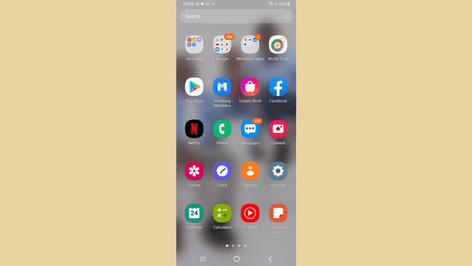

# World Time App

It is a Flutter app that runs on both android and IOS. This app lets you choose any city on this planet, then it immediately shows you the current time in that city and its time zone.

## Resources

It makes api calls from http://worldtimeapi.org/ they deserve alot of credit

  
